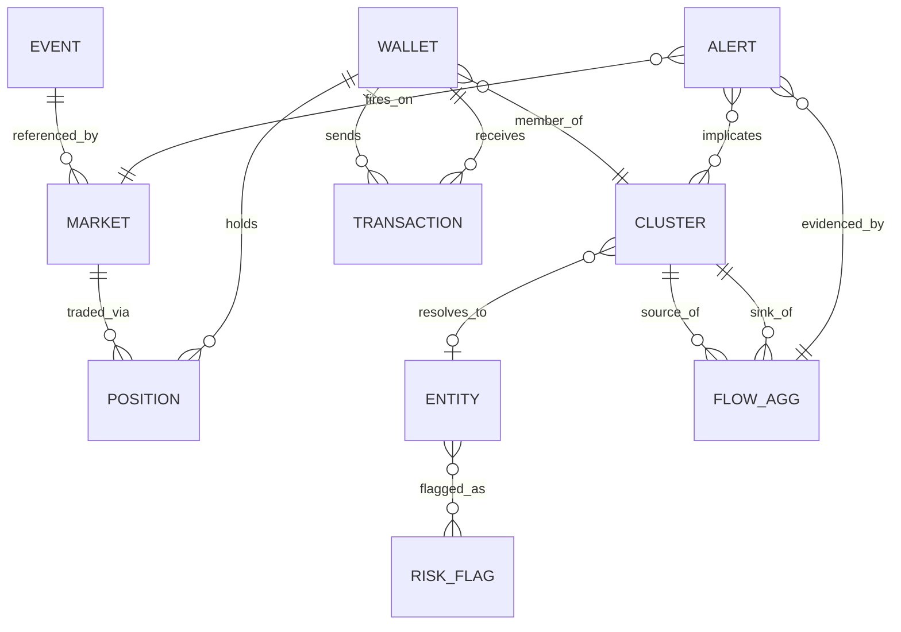
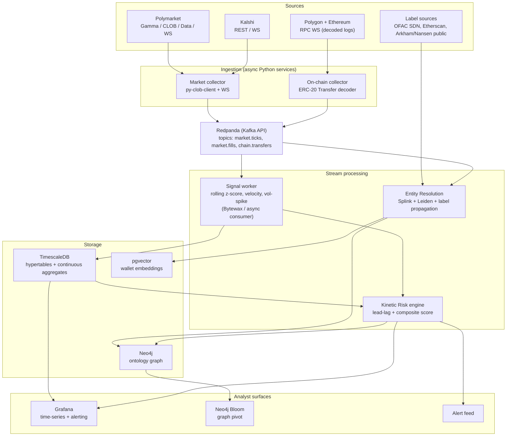

# Product Requirements Document
## Kinetic Risk Ontology (KRO)
### A prediction-market-to-on-chain threat-finance intelligence platform

**Author:** Ervin "EJ" Ward
**Status:** v1.0 — Build Spec
**One-liner:** A streaming intelligence system that fuses prediction-market conviction with on-chain financial behavior at the *wallet level*, surfacing early warnings when geopolitical probability spikes coincide with anomalous stablecoin movement from high-risk entity clusters.

---

## 0. Why this is a serious project (read this first)

Most "data fusion" portfolio projects join two datasets on a timestamp and call it correlation. This one doesn't, and the reason is a single technical fact that makes the whole thing defensible:

> **Polymarket trades settle on Polygon using the trader's own wallet.** Outcome positions are ERC-1155 tokens in the Conditional Token Framework, denominated in USDC.e, resolved by UMA's Optimistic Oracle. The address that holds a "YES — conflict by Q3" position is the *same address* you can trace for stablecoin inflows, bridge activity, and exchange routing.

That means the "soft" signal (market sentiment / conviction) and the "hard" signal (on-chain money movement) are **joinable on a primary key — the wallet address** — not loosely correlated on time. This is the difference between "I noticed two charts move together" and "I can name the wallet that knew something and show where its money went." The second is intelligence-grade. The first is a dashboard.

Everything downstream — the ontology, the entity resolution, the kinetic-risk scoring — exists to exploit that join.

**Why it maps to Palantir specifically:** Palantir's core abstraction is the *Ontology* — typed Objects, typed Links between them, and Actions that operate on them. Gotham (the gov/intelligence product) is built to let an analyst pivot from an object to its links to reveal a network. This PRD is deliberately structured the same way: we model the world as an ontology, not as tables, and the "product" is the analyst's ability to pivot from a market → to the wallets trading it → to the entities those wallets resolve to → to the flows between them → to an alert. If you walk a Palantir interviewer through the *ontology*, you are speaking their native language.

---

## 1. Problem statement & intelligence thesis

**The thesis:** Informed actors take financial positions ahead of geopolitical events, and prediction markets are one of the few public venues where that conviction becomes a *priced, timestamped, on-chain* signal. When a small set of high-PnL wallets moves a market's probability sharply *and* those same wallets (or wallets they fund) show anomalous stablecoin behavior, that conjunction is a higher-confidence early-warning signal than either source alone.

**The problem KRO solves:** An analyst watching prediction markets sees probability move but can't tell *who* moved it or whether real money is repositioning behind it. An analyst watching on-chain flows sees volume but has no *narrative* — no "why now." KRO joins the two so the analyst gets both the *what's-about-to-happen* (market) and the *who-and-how-much* (chain) in one pivot.

**Non-goals (state these explicitly — interviewers respect scoping):**
- Not a trading bot. We never place orders. (This also sidesteps the regulatory/jurisdiction surface of actually trading Polymarket.)
- Not a sanctions-compliance product. We *use* OFAC/sanctions lists as labels; we don't claim regulatory completeness.
- Not predicting market outcomes. We detect *anomalous conjunctions*, not "which side wins."

---

## 2. Users & primary use case

| Persona | What they do with KRO |
|---|---|
| **Threat-finance analyst** | Investigates whether money is repositioning ahead of an event; pivots wallet → cluster → entity → flow. |
| **OSINT / geopolitical analyst** | Watches a basket of conflict/policy/election markets; gets alerted when conviction *and* capital move together. |
| **Investigator (post-hoc)** | Given an event that happened, walks the graph backward to find who positioned early. |

**The canonical workflow (this is your demo script):**
1. A geopolitical market's probability spikes (velocity + volume z-score breach).
2. KRO identifies the wallets that drove the move (Polymarket Data API positions/fills).
3. Those wallets are resolved to entity clusters; KRO checks for risk flags (sanctioned, mixer-adjacent, known exchange deposit lineage).
4. In parallel, the on-chain engine detects an anomalous stablecoin flow surge involving those clusters.
5. The correlation engine scores the conjunction → emits a **Kinetic Risk Alert**.
6. Analyst opens Neo4j Bloom, pivots the alert's links, and reads the network story in 30 seconds.

---

## 3. Success metrics (operationalized — don't ship vanity numbers)

Your three headline metrics are good. The mistake juniors make is quoting them without a denominator. Define each one precisely so you can defend it under questioning.

| Metric | Headline | The precise, defensible version |
|---|---|---|
| **Throughput / scale** | 15,000+ events | "15,000+ normalized market-state and on-chain transfer **events** ingested and persisted in a backfill+live window, where an *event* = one price/probability tick, one trade fill, or one decoded ERC-20 Transfer." State the breakdown (e.g., ~9k market ticks, ~4k fills, ~2k on-chain transfers). |
| **Latency** | sub-200ms | "**p99 tick-to-queryable** on the *market-data hot path*: from WebSocket receipt to the derived signal being queryable in TimescaleDB. The on-chain path is block-time-bound (~2s on Polygon) by definition — we don't claim 200ms there, and the correlation window is designed around that asymmetry." |
| **Entity resolution** | 94% | "94% **pairwise F1** on a held-out labeled gold set of ~N wallet→entity mappings drawn from public labels (Etherscan tags, Arkham/Nansen public entities, OFAC SDN crypto addresses, exchange deposit wallets). Methodology: probabilistic linkage (Fellegi-Sunter via Splink) + graph community consolidation." |

> Interviewer tell: if you can say *"94% F1, not accuracy — accuracy is meaningless here because the negative class dominates pairwise comparison"* you immediately read as someone who has actually done ER. Accuracy on an imbalanced pairwise problem is a trap; F1 (or precision/recall separately) is the honest metric.

---

## 4. The Ontology (this is the centerpiece — lead with it in interviews)

Model the domain as typed **Objects**, **Links**, and **Actions**. This is both good engineering and the exact mental model Palantir uses.

### 4.1 Object types

| Object | Key properties | Source |
|---|---|---|
| **Event** | real-world event id, category (conflict/election/policy), resolution date | Derived from market metadata |
| **Market** | question, outcome tokens (ERC-1155 ids), probability, volume, liquidity, open interest, resolution source (UMA / CFTC) | Polymarket Gamma + CLOB; Kalshi REST |
| **Position / Fill** | wallet, market, side, size, price, ts | Polymarket Data API + CLOB WS |
| **Wallet** | address, chain, first/last seen, behavioral feature vector, smart-money score | On-chain + Polymarket Data API |
| **Cluster** | set of co-owned wallets, confidence | Entity-resolution output |
| **Entity** | resolved real-world actor (exchange, fund, treasury, sanctioned org, individual), labels | Public label sources |
| **Transaction** | token, amount, from, to, block, ts | Polygon/Ethereum logs |
| **FlowAggregate** | cluster→cluster volume over rolling window, z-score vs baseline | Derived |
| **RiskFlag** | sanctioned / mixer-adjacent / exchange / high-risk-jurisdiction | OFAC SDN, label heuristics |
| **KineticRiskAlert** | composite score, triggering market move, triggering flow anomaly, implicated clusters, ts | Correlation engine |

### 4.2 The load-bearing link

`Wallet —holds→ Position —traded_via→ Market` **AND** `Wallet —sends/receives→ Transaction`

The same `Wallet` object sits on both sides. **That join is the entire thesis.** Everything else is plumbing around it.

### 4.3 Actions (Palantir-flavored)

`TRIGGER_ALERT`, `ESCALATE`, `TAG_ENTITY`, `ASSIGN_ANALYST`, `MARK_FALSE_POSITIVE` (this last one feeds back into tuning — mention it; it shows you think about the human-in-the-loop).

---

## 5. System architecture

### Stack rationale (why each piece, stated as a decision not a menu)

- **Ingestion: async Python.** Polymarket ships `py-clob-client`; Kalshi ships `kalshi-python`. Both expose WebSocket feeds. Python keeps you fast and is what you already build in. *Note the auth asymmetry you'll hit:* Polymarket CLOB uses EIP-712 (once) → HMAC-SHA256 per request; Kalshi uses API-key + RSA-PSS request signing with ~30-min token expiry. Gamma (Polymarket market data) is public/no-auth, which is most of what you need for read-only intelligence.
- **Bus: Redpanda, not Kafka.** Single binary, Kafka-API-compatible, no JVM/ZooKeeper babysitting. For a solo build that needs to *look* like real streaming infra without an ops tax, this is the correct call. You can say "Kafka-compatible" and it's true.
- **Stream processing: Bytewax (or plain async consumers).** Python-native, so your rolling-window math lives in the same language as everything else. If you want to flex distributed processing, Flink is the upgrade path — but don't over-engineer the v1; an interviewer will respect "I chose Bytewax because Flink's operational weight wasn't justified at this scale" more than a half-working Flink job.
- **TimescaleDB, not raw Postgres.** You already live in Postgres/Supabase. Timescale is a Postgres extension — hypertables + continuous aggregates give you fast time-windowed rollups (z-scores, velocity baselines) for free, and Grafana has a first-class Timescale datasource. Zero new mental model.
- **Neo4j for the ontology, Bloom for the pivot.** The graph *is* the product. Bloom gives you the analyst-facing visual pivot that reads as intelligence tradecraft.
- **pgvector** (same Postgres instance) for wallet behavioral embeddings used in entity resolution — no separate vector DB needed.

---

## 6. Data-source reality (the section that wins technical interviews)

Your briefing flagged that this data is noisy. **Confronting that head-on is the single biggest credibility move available to you.** Build these defenses and talk about them:

1. **Thin-market filtering.** Most Polymarket markets are illiquid. Require minimum liquidity / open interest / 24h volume thresholds before a market is eligible for signaling. A 40% probability swing on a $200 market is noise; the same swing on a deep market is signal.
2. **Smart-money weighting.** Polymarket's Data API exposes per-wallet PnL and a leaderboard. Weight a market move by *who* is driving it — moves led by historically high-PnL wallets get higher signal weight. This is your answer to "how do you filter for smart money."
3. **Wash-trade / self-dealing suppression.** Detect circular fills and same-cluster counterparties (you already have the clusters from ER) and discount them.
4. **Cross-venue confirmation.** When Kalshi and Polymarket price the *same* underlying event, agreement raises confidence; divergence is either arbitrage or one venue being wrong — either way, flag it rather than trust it blindly.
5. **Probability vs. price honesty.** Polymarket outcome-token prices approximate probability but aren't calibrated probabilities. Treat price *changes* (velocity, z-score) as the signal, not absolute levels — change is more robust to miscalibration.

> The honest one-liner for the interview: *"Prediction markets are noisy, so I never trust a single market's absolute level. I trust liquidity-gated, smart-money-weighted *moves*, confirmed cross-venue where possible."*

---

## 7. Component deep-dives

### 7.1 Entity resolution (the 94%)

This is where most candidates wave their hands. Be specific. Use a **three-stage pipeline**, because no single technique gets you there:

1. **Blocking.** You cannot do all-pairs comparison across thousands of wallets (it's O(n²)). Block on cheap keys — shared counterparties, shared funding source, temporal activity buckets — to reduce candidate pairs by orders of magnitude. *Mention blocking unprompted; it's the thing that proves you've done ER at scale, not in a toy.*
2. **Probabilistic linkage (Fellegi-Sunter via Splink).** For surviving candidate pairs, score match probability over behavioral features: funding lineage, gas-funding source, counterparty overlap, token-mix similarity (cosine over pgvector embeddings), temporal co-activity. Splink is an open-source, well-respected implementation of the Fellegi-Sunter model — naming it signals you know the canonical ER literature.
3. **Graph consolidation (Leiden community detection) + label propagation.** Build the wallet co-activity graph, run Leiden to consolidate linked pairs into clusters, then propagate known labels (from OFAC SDN, exchange deposit addresses, public Arkham/Nansen entities) outward from seed nodes.

**Evaluation:** hold out a labeled subset, report **pairwise precision / recall / F1**. Your 94% is the F1. State the gold-set size and label provenance. Discuss the failure mode honestly: privacy tooling (mixers, fresh-wallet hygiene) is *designed* to defeat clustering, so recall degrades on sophisticated actors — and you can frame *that gap itself* as a signal (deliberate unlinkability is suspicious).

### 7.2 Kinetic Risk correlation engine

This is where your quant background shows (and you can credibly claim it — you've built multi-layer signal stacks before). Don't just multiply two z-scores.

- **Market signal:** for each eligible market, compute probability **velocity** (1st derivative) and **acceleration** (2nd derivative), and a **volume z-score** vs a rolling baseline (Timescale continuous aggregate). A real signal is a fast move on rising volume, not a drift on dead volume.
- **On-chain signal:** for each cluster, compute stablecoin **flow z-score** vs its own baseline, plus directionality (accumulating vs. distributing) and routing (toward exchanges / bridges / mixers).
- **Fusion via lead-lag, not coincidence.** Run a windowed **cross-correlation / lead-lag** between the market-move series and the cluster-flow series. The *interesting* case is when flow *leads* the market move (someone moved money, then conviction repriced) or tightly trails it. A simple Granger-causality test over the window is a defensible, recognizable choice here and ties directly to time-series methods you've used.
- **Composite Kinetic Risk Score:**
  `score = f(market_move_significance) × g(flow_anomaly) × h(entity_risk_weight) × lead_lag_confidence`
  where `entity_risk_weight` is elevated for sanctioned/mixer-adjacent/high-risk-jurisdiction clusters. Tunable weights, with the `MARK_FALSE_POSITIVE` action feeding back to recalibrate.
- **Output:** when `score > threshold`, emit a `KineticRiskAlert` object into Neo4j with links to the triggering market, the flow aggregate, and the implicated clusters — *fully pivotable in Bloom.*

### 7.3 The latency budget (defend the 200ms)

Hot path, market data only:

| Stage | Budget |
|---|---|
| WS receipt → parse/normalize | < 5 ms |
| produce to Redpanda (local) | < 10 ms |
| consumer read + rolling z-score/velocity (in-memory window) | < 20 ms |
| batched async write → TimescaleDB, state queryable | remainder |
| **p99 tick-to-queryable** | **< 200 ms** |

State plainly that the **on-chain path is intentionally not in this budget** — it's bounded by Polygon block time (~2s), so the correlation engine operates on a rolling window wide enough to absorb that asymmetry. *Volunteering this distinction is a strength; pretending 200ms applies to on-chain confirmation is an instant red flag to anyone who knows blockchains.*

---

## 8. Build roadmap (step-by-step, phased)

Built so each phase is independently demoable — if you run out of time, you stop at a phase boundary with something complete, never a half-thing.

**Phase 0 — Spine (the join exists).** Stand up Redpanda + TimescaleDB + Neo4j (docker-compose). Ingest Polymarket Gamma market metadata + CLOB WS price ticks for a curated basket of ~20 geopolitical markets. Persist ticks to a Timescale hypertable. *Demoable: live probability charts in Grafana.*

**Phase 1 — On-chain hot path.** Add the Polygon RPC WS collector decoding USDC.e / USDT ERC-20 Transfer logs. Pull Polymarket Data API positions/fills so you have the **wallet ↔ market** link. *Demoable: "here are the wallets that traded this market, and here's their on-chain transfer activity."* This is the moment the thesis becomes real — make sure you can narrate it.

**Phase 2 — Ontology in Neo4j.** Write the object/link model. Load Markets, Wallets, Positions, Transactions. Get a Bloom pivot working: market → wallets → transactions. *Demoable: the analyst pivot.*

**Phase 3 — Entity resolution.** Blocking → Splink → Leiden → label propagation. Build the labeled gold set, report F1. Add Entity and Cluster objects and the `resolves_to` links. Wire in RiskFlags from OFAC SDN crypto addresses. *Demoable: "this cluster resolves to a sanctioned entity."*

**Phase 4 — Kinetic Risk engine + Warning System.** Signal workers (z-score/velocity/flow-anomaly), lead-lag correlation, composite scoring, `KineticRiskAlert` emission, Grafana alerting + alert feed. *Demoable: the full canonical workflow end-to-end — the thing you actually show in the interview.*

**Phase 5 — Hardening / honesty layer.** Thin-market gating, smart-money weighting, wash-trade suppression, cross-venue (Kalshi) confirmation, false-positive feedback loop. *This phase is what separates "I built a demo" from "I thought about whether the signal is real."*

> Scoping guidance: Phases 0–4 are the resume project. Phase 5 is what you *talk about* even if you only partially implement it — having the defenses designed and a couple implemented is enough to discuss them credibly. Don't fake completeness; "designed, partially implemented, here's the tradeoff" is a stronger interview answer than a brittle full build.

---

## 9. Risks & mitigations

| Risk | Mitigation |
|---|---|
| Polymarket/Kalshi rate limits (Cloudflare 429s) | Backoff + pagination; prefer WS over REST polling; cache Gamma metadata |
| Signal is mostly noise | The entire §6 honesty layer; report precision on alerts, not just that alerts fire |
| ER recall collapses on privacy-savvy actors | Acknowledge it; treat deliberate unlinkability as its own weak signal |
| Latency claim challenged | Pre-defined budget (§7.3) + the on-chain asymmetry framing |
| "Isn't this just two charts?" | The wallet-level join (§0). Lead with it, always. |
| Regulatory optics of touching Polymarket | Read-only, no trading, no jurisdiction exposure — state it in non-goals |

---

## 10. How to talk about this (HR vs. technical interviewer)

You asked for both registers. Here they are.

### The 30-second HR / recruiter pitch
> "I built an intelligence platform that connects prediction markets to blockchain financial data. When a geopolitical market — say, on a conflict or an election — moves sharply, the system identifies the specific wallets driving it, resolves those wallets to real-world entities, and checks whether the same actors are moving money in suspicious ways on-chain. When conviction and capital move together, it raises an early-warning alert. It's the kind of data-fusion-into-analyst-tooling problem that companies like Palantir exist to solve."

### The 2-minute technical pitch
> "The core insight is that Polymarket settles on-chain with the trader's own wallet, so prediction-market conviction and on-chain money movement are joinable on a primary key — the address — not just correlated on time. I built a streaming pipeline: async Python collectors feed a Redpanda bus, signal workers compute rolling z-scores and velocity into TimescaleDB on a sub-200ms hot path, and an entity-resolution stage — blocking, then Splink probabilistic linkage, then Leiden community detection with label propagation — resolves wallets to entity clusters at 94% pairwise F1. A correlation engine runs lead-lag analysis between market moves and cluster-level stablecoin flow anomalies; when the composite risk score breaches threshold, it emits a typed alert into a Neo4j ontology that an analyst pivots in Bloom. I modeled the whole domain as Objects, Links, and Actions deliberately — because that's the abstraction this kind of analyst tooling needs."

### Likely deep-dive questions (and the honest answers)
- **"Isn't this just spurious correlation?"** → The wallet-level join (§0). I'm not correlating two time series; the same address is on both sides. And I gate on liquidity, weight by smart-money PnL, and require lead-lag structure, not coincidence.
- **"How is 94% measured?"** → Pairwise F1 on a held-out labeled gold set, not accuracy — accuracy is meaningless on an imbalanced pairwise problem. Labels from OFAC SDN, Etherscan tags, public Arkham/Nansen entities.
- **"How do you hit 200ms?"** → It's p99 tick-to-queryable on the *market* hot path; here's the budget. On-chain is block-time-bound at ~2s, so it's deliberately *not* in that number, and the correlation window absorbs the asymmetry.
- **"What breaks your entity resolution?"** → Privacy tooling — mixers, fresh-wallet hygiene — is built to defeat clustering, so recall degrades on sophisticated actors. I treat that unlinkability as a weak signal in itself.
- **"Why Redpanda over Kafka? Why Bytewax over Flink?"** → Operational weight wasn't justified at this scale; both give me the right semantics (Kafka API, streaming windows) without the ops tax, and I can articulate the upgrade path if scale demanded it.

### The personal-credibility connection (use this, it's true for you)
You've built multi-layer signal stacks with z-scores, regime filters, and rolling-window statistics on real time-series infrastructure before. The kinetic-risk correlation engine is the *same class of problem* in a new domain — so when an interviewer pushes on the quant methods (lead-lag, Granger, z-score baselines), you're not reciting; you've shipped this kind of math. Lean on that. It's the difference between someone who read about signal processing and someone who's debugged it at 2am.

---

## 11. What to actually build vs. what to claim

Build Phases 0–4 honestly. Implement enough of Phase 5 to discuss the honesty layer with a straight face. **Never claim a metric you can't reconstruct on a whiteboard.** The fastest way to lose a Palantir-style interview is a number you can't derive when they ask "walk me through how you got that." Every metric in §3 is written so you *can* derive it. Keep it that way.
